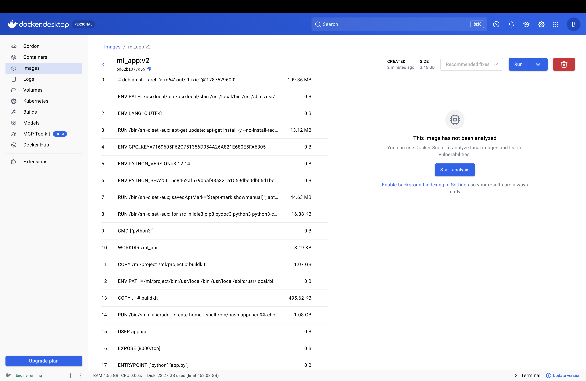
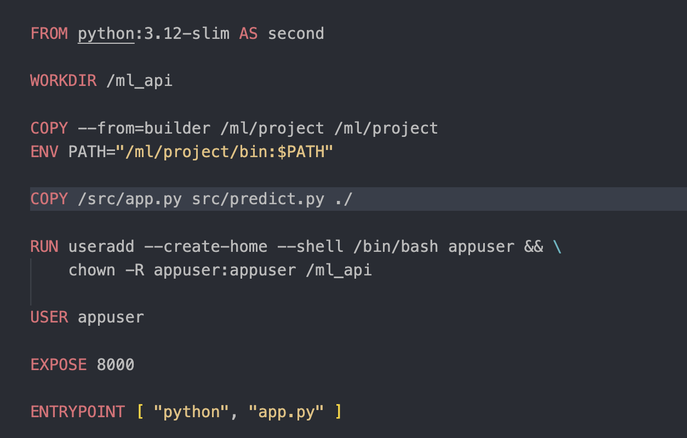

# ML API + Docker

Простой ML API на FastAPI с контейнеризацией.

## Стек
- FastAPI
- scikit-learn / XGBoost
- Docker (multi-stage build)
- Docker Compose

## Что сделано
- Multi-stage Dockerfile
- Виртуальное окружение в образе
- Запуск от non-root пользователя
- .dockerignore

В image1 видно, что образ весит почти 4гб (да, это ML но всё равно не очень приятно)

## Обратим внимание на 11 и 14 строку

Я копирую полностью папку проекта, но зачем? И также даю права всей папке а это бессмысленно. Попробую это оптимизировать

надо посмотреть на image2

## И вот что меня обрадовало после сборки образа (image3)

Образ стал легче на 2ГБ!!!! Я считаю это хороший результат, но всё равно это ML. Присутствуют тяжелые библиотеки Но я считаю что это хорошая практика для меня

